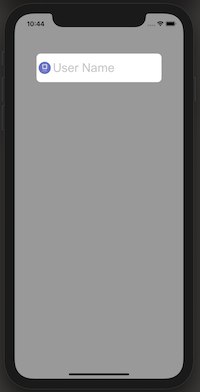
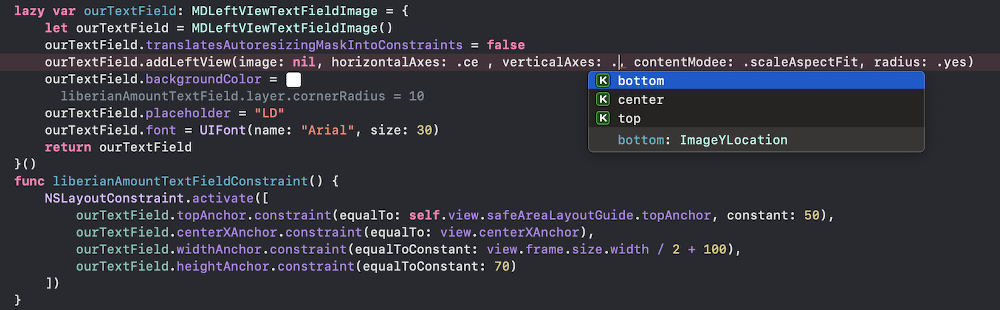

# MDTextField 2.0.0
 add Image to the left of your UITextField.
 #### Cocoapod : https://cocoapods.org/pods/MDTextField

# What does it look like ? 

# What does MDTextField do ?
It allows you too add image/space to the left side of a UITextField with a single  line of code

# How is it set up ?
#### Using cocoaPods ( Reccommended)
` ` ` pod 'MDTextField' 
` ` `  
Then you can install it with pod install command.

# How to used ( Programmatic Example )?

After install, import pod into your ViewController  
` ` ` import MDTextField
` ` ` 
 
* At declearation, set  your UITextField to of type MDTextField to be able to access methods in the class. 
* Use  .addLeftView() method to add image,  size etc.  Don't forget to set TextField constrain by your self. 
* ‼️ For space only, set the image paramater to nil
* .center is default for horizontal & vertical axes = ( x, y)

