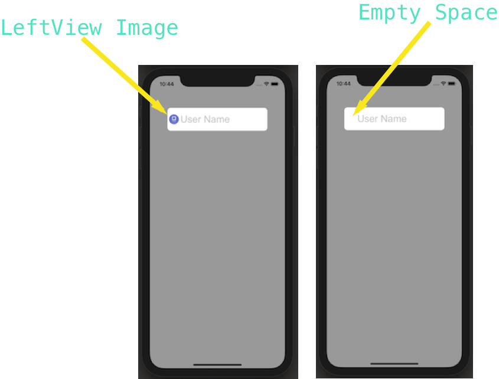

# MDTextField
 add Image to the left of your UITextField.
 #### Cocoapod : https://cocoapods.org/pods/MDTextField

# What does it look like ? 

 
 
# What does MDTextField do ?
It allows you too add image of the left side of a UITextField

# How is it set up ?
### Using cocoaPods ( Reccommended)
` ` ` pod 'MDTextField' 
` ` `  
Then you can install it with pod install command.

# How is it used ?

